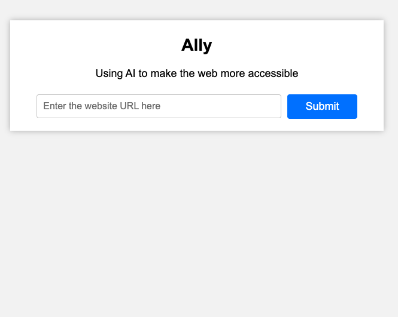
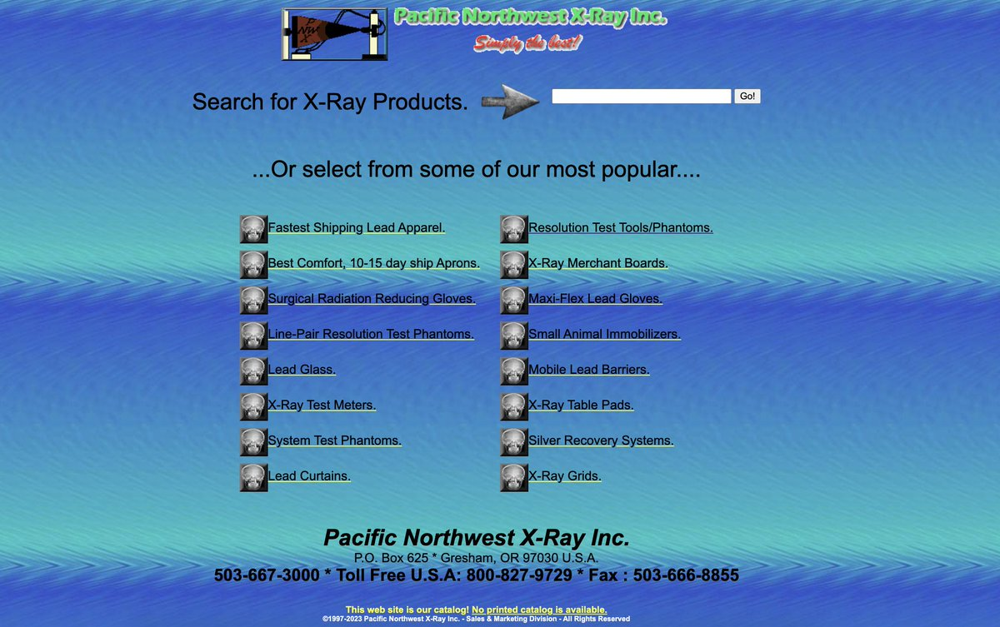
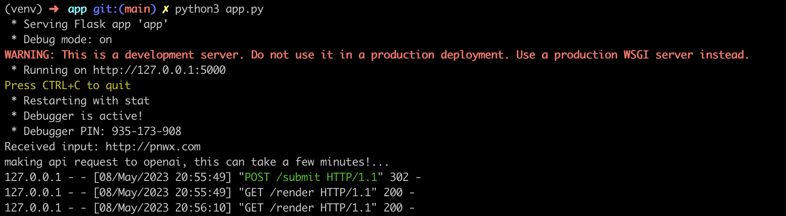
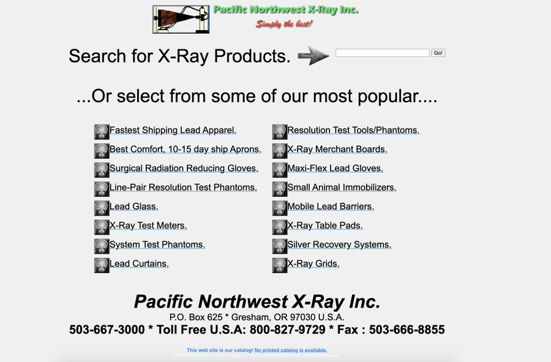

# ally
AI-powered web app that makes use of a Large Language Model (LLM) to generate code to make websites more accessible to disabled individuals, helping to ensure compliance with ADA regulations.

## Setup

1. Make a copy of the environment file and add your OPENAI API key to it as shown below.

```bash
$ cp .env-example .env
```

Add your [API key](https://platform.openai.com/account/api-key) to the newly created `.env` file.

2. Setup a python virtual environment and install dependencies

```bash
$ python3 -m venv venv

$ source venv/bin/activate

$ pip3 install -r requirements.txt
```

3. Run the Flask App from the `app` folder

```bash
python3 app.py
```

Navigate to [http://127.0.0.1:5000](http://127.0.0.1:5000). You should see the following website -



Input the following (well tested) URL in the form: [http://pnwx.com](http://pnwx.com).
We chose this website because it several disability issues (take a look)!



The app scrapes the webpage and passes the HTML to GPT4 for processing. You should see the following logs on your terminal -



Final result!

